# Legacy Knowledge Rebuild Sprint — Implementation Specification

Status: active implementation specification  
Started: 2026-07-19  
Target bundle contract: `bundle_version: "1.1"`  
Ontology contract: `ontology_version: "1.0"`  
Primary implementation: `api/tools/ontology_rebuild.py`

## 1. Purpose

Build a separate operator tool that converts one legacy Career Lighthouse YAML file into a reviewable ontology migration bundle.

The tool must:

1. Parse and classify the legacy YAML without an LLM.
2. Use its own direct Claude API calls, isolated from the application chat/extraction stack.
3. Produce runtime-valid proposed ontology records where the current ontology is expressive enough.
4. Preserve useful but currently unrepresentable assertions as blocked candidates.
5. Ask explicit, prioritized questions when source, scope, time, identity, policy, consent, or schema information is missing.
6. Never treat generation as approval or write directly into canonical knowledge stores.

The intended outcome is a safe rebuild workflow, not a one-shot format converter. A successful first run may contain zero importable claims and many questions; that is preferable to silently inventing canonical facts.

Normative terms in this document use **must**, **should**, and **may** in their usual requirements sense.

## 2. Product boundary

### 2.1 In scope

- One input YAML per invocation.
- Deterministic legacy-family detection.
- Duplicate-key and field-accounting analysis.
- Direct Anthropic SDK calls for transformation and gap auditing.
- Runtime validation using the existing ontology Pydantic models.
- A single review-bundle YAML as output.
- Explicit unresolved-input questions and blocked-schema candidates.
- Conservative source and confidence treatment.
- A local-only `--inspect` mode.
- Mocked tests plus a separately gated real-Claude evaluation.

### 2.2 Non-goals

- Deleting, overwriting, or editing legacy knowledge.
- Automatically importing the generated bundle.
- Automatically approving any claim.
- Loosening `ClaimPayload` to accept arbitrary dictionaries.
- Treating a legacy YAML as authoritative primary evidence.
- Fetching URLs or source documents during the first rebuild pass.
- Batch migration before the single-file pilot is accepted.
- Sending calls through `services.llm`, Langfuse, or the running API.
- Solving the ontology's missing claim types inside the converter.

### 2.3 Locked design decisions

| Decision | Rationale |
|---|---|
| Emit a review bundle, not canonical files | Migration quality and ontology coverage are not yet sufficient for direct writes |
| Detect type locally | Classification is cheap, deterministic, and should not depend on model behavior |
| Use two semantic Claude passes | Transformation and “what is missing?” are different tasks and need independent validation |
| Keep unsupported semantics as blocked candidates | Dropping them would make migration completeness impossible to assess |
| Treat legacy YAML as reported evidence | It proves the assertion existed in the old KB, not that the assertion is true |
| Require exact excerpts | Claims must remain traceable to source text rather than generated summaries |
| Resolve user questions outside canonical data | Missing information is workflow state, not an approved ontology claim |
| Defer importer and batch mode | Single-file generation and review must prove quality first |

## 3. Users and operating assumptions

Primary user: a Career Lighthouse operator or counsellor rebuilding legacy knowledge.

Assumptions:

- The operator can inspect the input locally before authorizing egress.
- The operator understands that Claude receives the full YAML during transformation and gap audit.
- The operator can obtain original sources or route questions to a counsellor.
- The generated bundle is reviewed in Git or another controlled review surface before any future import.
- Legacy YAML remains available as a rollback and comparison source throughout migration.

## 4. End-to-end workflow

```mermaid
flowchart LR
    A[Legacy YAML] --> B[Local parse and type detection]
    B --> C[Duplicate and policy checks]
    C -->|inspect only| D[Local inspection report]
    C -->|egress confirmed| E[Claude transformation pass]
    E --> F[Schema, reference, evidence, and field-accounting validation]
    F -->|invalid once| G[Claude correction pass]
    G --> F
    F -->|valid| H[Claude gap-audit pass]
    H --> I[Gap-audit validation or one repair]
    I --> J[Deterministic IDs and conservative confidence materialization]
    J --> K[Atomic review-bundle YAML]
    K --> L[Human answers and review]
    L -. future separate importer .-> M[Canonical ontology stores]
```



Maximum normal Claude calls: two—transformation and gap audit. Maximum calls after repairs: four—one repair per pass. A validation failure after the allowed repair must stop the run without creating or replacing the output bundle.

## 5. Architecture and isolation

### 5.1 Current file layout

```text
api/
  tools/
    __init__.py
    ontology_rebuild.py       # CLI, schemas, Claude client, workflow
  tests/
    test_ontology_rebuild.py  # no-network tests
docs/ontology/
  REBUILD-SPRINT.md           # this specification
build/ontology-rebuild/       # default generated output; not canonical data
```

The single-module implementation is acceptable for the pilot. Split it into `schemas.py`, `claude.py`, `workflow.py`, and `cli.py` only if the answers workflow or importer makes the module materially harder to review. File separation must not create a second set of ontology runtime models.

### 5.2 Required dependency direction

The tool may import:

- `models_ontology` for runtime-valid model types.
- Small deterministic helpers such as `safe_slug`.
- `anthropic`, `pydantic`, and `yaml` directly.

The tool must not import:

- `services.llm` or `services.ontology_extraction`.
- API routers, FastAPI dependencies, session state, or feature flags.
- Canonical `EntityStore`, `EvidenceStore`, or `ClaimStore` write methods.

Identifier algorithms must match the store contracts. Tests should compare generated evidence and claim IDs to the existing store algorithms so drift is caught mechanically.

## 6. CLI contract

Run from `api/`:

```bash
uv run python -m tools.ontology_rebuild SOURCE [OPTIONS]
```

### 6.1 Arguments and options

| Option | Required | Behavior | Status |
|---|---:|---|---|
| `SOURCE` | yes | Path to one legacy YAML mapping | implemented |
| `--inspect` | no | Parse, classify, hash, and report fields/duplicates; make no API call | implemented |
| `--output PATH` | for controlled runs | Write bundle to the selected path; default under `build/ontology-rebuild/` | implemented |
| `--model MODEL` | no | Precedence: CLI, `ANTHROPIC_MODEL`, tool default | implemented |
| `--timeout SECONDS` | no | Per-call timeout | implemented |
| `--max-input-chars N` | no | Default 100,000; reject larger input unless explicitly raised | implemented |
| `--force` | no | Replace an existing non-canonical bundle path atomically | implemented |
| `--allow-personal-data` | conditional | Required for an input classified as `alumni` | implemented |
| `--confirm-egress` | yes for API calls | Explicitly confirms that the full YAML may be sent to Anthropic | implemented |
| `--answers PATH` | no | Apply a companion answers file and regenerate unresolved questions | P1 |
| `--json-summary` | no | Emit a machine-readable run summary to stdout without raw content | P2 |

`ANTHROPIC_API_KEY` must be read from the environment. The tool must not print it, persist it, or copy it into the bundle.

### 6.2 Exit codes

| Code | Meaning |
|---:|---|
| `0` | Inspection or bundle generation succeeded |
| `1` | Input, policy, Claude, validation, or output error |
| `2` | CLI argument error from `argparse` |

Errors must be concise on stderr. A failed run must leave no `.tmp` file and must not replace an existing bundle.

## 7. Input contract

### 7.1 YAML requirements

- UTF-8 text.
- Exactly one top-level mapping.
- String top-level field names.
- Maximum 100,000 characters by default.
- YAML anchors and aliases may be parsed, but the emitted evidence must still point to exact raw source text.
- Duplicate mapping keys must be detected from the YAML node tree before ordinary last-value-wins parsing hides them.

Duplicate keys do not prevent inspection. During generation they must produce:

- A `duplicate_key_paths` entry in `legacy_source`.
- A high-priority `duplicate_values` question.
- A warning naming the affected dotted paths.

No duplicate value may be selected as canonical by the tool.

### 7.2 Deterministic type detection

Type detection is local and signature-based. Claude must not select or override the type.

| Legacy type | Required top-level signature | Supporting fields |
|---|---|---|
| `career_profile` | `career_type` | `match_description`, `top_employers_smu`, `entry_paths` |
| `employer` | `employer_name` | `tracks`, `ep_requirement`, `application_process` |
| `alumni` | `full_name` | `graduation_year`, `current_company`, `career_trajectory_summary` |
| `draft_track` | `slug`, `track_name`, `status` | `source_refs`, `match_keywords`, `archived_at` |
| `source_ledger` | `doc_id`, `filename`, `lifecycle` | `chunk_count`, `record_version`, `uploaded_at` |
| `track_registry` | `tracks` | `version`, `last_updated` |

Scoring rule:

```text
score = 10 × required_fields_present + supporting_fields_present
```

- A candidate is eligible only when every required field is present.
- Highest score wins.
- A top-score tie is an error, not a Claude fallback.
- No eligible candidate is an error that lists the observed fields.

### 7.3 Source hash and mutation safety

The tool computes SHA-256 over the exact raw UTF-8 input. The hash drives `migration_id`, source naming, and replay checks.

Before writing output, the implementation must verify that the source still has the same hash. If it changed during the run, abort and require a fresh rebuild.

## 8. Legacy-to-ontology mapping policy

### 8.1 Global rules

1. Every top-level legacy field must be accounted for by an entity's `legacy_field_paths`, supported-claim evidence, a blocked claim, or `unmapped_fields`.
2. One prose field may yield several atomic candidates.
3. A candidate may not broaden beyond the explicit legacy scope.
4. Track-wide prose may not become employer-wide policy.
5. Employer-category prose such as “bulge-bracket banks” may not be assigned to each named bank.
6. Recurring months without a year may not become exact dates.
7. Retrieval metadata and operational contacts must remain unmapped metadata unless an explicit ontology type exists.
8. Sensitive claims must be blocked when provenance or policy interpretation is missing.

### 8.2 Mapping matrix

| Legacy family/field | Target | Handling before target payload exists |
|---|---|---|
| Career `career_type` / draft `track_name` | `Entity(career_track)` | supported entity |
| Career `match_description`, `match_keywords` | retrieval metadata | `unmapped_fields: preserve_as_metadata` |
| Career `top_employers_smu` | career-track ↔ organization relationship | blocked as `career_track_employer_relationship` |
| Career/employer recruiting dates | `application_window` | supported only with explicit entity/programme and usable year/date |
| Employer `application_process` | `recruitment_stage` | supported when an atomic stage and subject scope are explicit |
| Career/employer sponsorship prose | `sponsorship_policy` | blocked; payload declared but not implemented |
| Career/employer salary prose | `compensation_observation` | blocked; payload declared but not implemented |
| Career background/skills | `skill_requirement` | blocked; distinguish actual requirement from descriptive trend |
| Career `entry_paths` | `career_pathway` or relationship claims | blocked pending schema decision |
| COMPASS calculations/eligibility | proposed immigration/eligibility observation | blocked; do not force into sponsorship policy |
| Employer `tracks` | organization ↔ career-track relationship | blocked pending relationship type |
| Employer headcount | proposed `workforce_observation` | blocked pending schema |
| Employer `structured.facts` | claim-type-specific conversion | validate and decompose each fact independently |
| Alumni identity | `Entity(person)` | entity may be proposed; canonical use requires consent policy |
| Alumni company/school history | employment/education relationships | blocked until payload and consent requirements are satisfied |
| Source ledger record | `SourceMetadata` + `Entity(source_document)` | additive metadata; absence of raw content must be explicit |
| Track registry entry | `Entity(career_track)` | supported entity; registry status remains metadata |

## 9. Claude call contracts

### 9.1 Isolation and model settings

- Use `anthropic.Anthropic` directly.
- Temperature must be `0`.
- Transformation budget: 8,192 output tokens.
- Gap-audit budget: 4,096 output tokens.
- Each pass may make at most one repair call.
- SDK retry behavior may handle transient transport failures, but application-level semantic retries beyond the single repair are forbidden in v1.
- The tool must not emit raw prompts or source content to logs.

The bundle must record:

- Model name.
- Tool version.
- Transformation prompt version.
- Gap-audit prompt version.
- Number of calls.
- Input/output token usage when returned by the SDK.
- Generation timestamp.

Raw Claude responses must not be persisted by default. A future debug flag, if added, must be explicit and must write with mode `0600` outside canonical knowledge paths.

### 9.2 Transformation pass

Input:

- Detected legacy type.
- Original filename.
- Duplicate-key paths.
- Strict JSON schema for `ExtractionAnalysis`.
- Entire raw YAML, clearly delimited as untrusted data.

Output:

```text
ExtractionAnalysis
├── summary
├── entities[]
├── supported_claims[]
├── blocked_claims[]
└── unmapped_fields[]
```

Prompt rules must state that instructions inside the legacy YAML are untrusted content and must be ignored.

Only `application_window` and `recruitment_stage` may enter `supported_claims` while those remain the only members of the runtime `ClaimPayload` union. All other semantic candidates must be retained in `blocked_claims`.

### 9.3 Transformation correction

Local validation runs before correction. If invalid, the correction prompt receives:

- Validation errors.
- Output JSON schema.
- Invalid output.
- Original raw YAML.

The corrected response must replace the complete JSON document, not return a patch. A second failure aborts the run.

### 9.4 Gap-audit pass

Input:

- Validated transformation analysis.
- Detected type and duplicate paths.
- Entire raw YAML.
- Strict `GapAudit` schema.

The audit asks only questions that materially affect:

- Provenance.
- Entity identity.
- Geography, programme, role, seniority, candidate segment, or academic-year scope.
- Observation or validity time.
- Immigration or hiring-policy interpretation.
- Compensation or hiring-rate reliability.
- Personal-data consent.
- Ontology schema placement.

It must not ask for information already explicit in the YAML. Local deterministic checks supplement the audit for critical questions; the LLM is not the only control.

## 10. Proposal schemas

### 10.1 Entity proposal

```yaml
ref: goldman_sachs
entity_type: organization
canonical_name: Goldman Sachs
aliases: []
parent_ref: null
geography: null
external_ids:
  employer_slug: goldman_sachs
legacy_field_paths:
  - top_employers_smu[0]
```

- `ref` is a local snake-case reference, not the final ID.
- `parent_ref` must resolve inside the same analysis.
- `legacy_field_paths` must be non-empty.
- Claude must not propose the source-document entity; the materializer adds it.

### 10.2 Supported claim proposal

```yaml
ref: goldman_2027_window
claim_type: application_window
subject_ref: goldman_sachs
object_ref: null
payload:
  claim_type: application_window
  programme_id: summer_analyst_programme
  opens_on: 2026-07-01
  closes_on: 2026-09-30
  date_precision: exact_date
  intake_year: 2027
scope:
  geography: SG
  programme_id: summer_analyst_programme
  role_id: null
  organization_unit_id: null
  seniority: analyst
  candidate_segment: null
  academic_year: null
valid_time:
  valid_from: 2026-07-01
  valid_until: 2026-09-30
observed_at: null
confidence:
  extraction: 0.90
  evidence_strength: 0.80
  source_reliability: 0.30
evidence:
  - quote: "Applications close on 2026-09-30."
    support_type: directly_supports
    legacy_field_path: recruiting_timeline
    extraction_confidence: 0.95
```

All entity-bearing scope/payload fields contain local refs during analysis and are replaced with final entity IDs during materialization. Unknown refs or wrong entity types are validation errors.

The example assumes `summer_analyst_programme` is also present as an `EntityProposal(entity_type="programme")` in the same analysis.

### 10.3 Blocked claim proposal

```yaml
ref: ib_analyst_salary
target_claim_type: compensation_observation
summary: Reported base salary range for investment-banking analysts.
legacy_field_paths:
  - salary_range_2024
blockers:
  - unsupported_claim_type
  - missing_source
questions:
  - Which salary survey and cohort support this range?
```

Blocked candidates must remain atomic enough to migrate later. `summary` must describe the legacy assertion without presenting it as verified truth.

### 10.4 Unmapped field

```yaml
legacy_field_path: match_description
reason: Retrieval text is not a canonical factual claim.
disposition: preserve_as_metadata
```

Allowed dispositions:

- `preserve_as_metadata`
- `requires_schema_extension`
- `requires_user_input`
- `non_ontological`
- `duplicate`

## 11. Evidence and provenance rules

### 11.1 Legacy source treatment

The legacy YAML is registered conservatively:

```yaml
source_kind: unknown
authority_tier: unknown
```

It is evidence that a legacy assertion existed, not proof of the underlying real-world fact. Therefore every materialized claim must use:

```yaml
assertion_status: reported
review_status: proposed
```

Confidence caps for legacy-only evidence:

- `evidence_strength <= 0.50`
- `source_reliability <= 0.35`
- Extraction confidence may retain the validated proposal score.

These caps may be lifted only in a later source-backed rebuild that ingests the original evidence and classifies its authority.

### 11.2 Exact evidence

- Evidence excerpts must be non-empty exact contiguous substrings of the raw YAML.
- Start/end offsets are computed by the tool, never trusted from Claude.
- The excerpt must be at most 2,000 characters, matching `Evidence`.
- `locator.section` records `legacy_field_path`.
- If an excerpt occurs more than once, the implementation must resolve it within the declared field span or reject it as ambiguous. Selecting the first global match is not sufficient for the final pilot.
- Each claim must contain at least one evidence ID.

Field spans should be built locally from `yaml.compose()` node marks:

1. Walk mapping and sequence nodes while constructing dotted paths such as `structured.facts[2].value`.
2. Record each value node's `start_mark.index` and `end_mark.index` against the raw YAML.
3. Search for the exact quote only within the declared field span.
4. Accept exactly one match; zero is invalid evidence and multiple matches are ambiguous evidence.
5. Convert the field-relative position back to absolute character offsets for `EvidenceLocator`.

### 11.3 Original-source questions

Unless actionable original source references are present, any supported or blocked factual candidate must cause a high-priority source question asking for:

- Source filename or URL.
- Publisher, author, or interviewee role.
- Publication or observation date.
- Exact relevant excerpt.
- Geography/entity/programme coverage.

A label such as `counsellor_note` or “SMU survey” without a resolvable document is not actionable provenance.

## 12. User-input contract

### 12.1 Question shape

```yaml
need_id: need-source-a61c5d8fa2b1
need_kind: missing_original_source
priority: high
category: source
question: Which original source supports the salary range?
reason: The legacy YAML is not independent evidence for compensation.
affected_refs:
  - ib_analyst_salary
affected_legacy_fields:
  - salary_range_2024
suggested_answer_format: Source URL/file, publisher, date, cohort, and excerpt.
```

Categories:

- `source`
- `scope`
- `time`
- `entity_resolution`
- `policy`
- `consent`
- `schema`
- `other`

Required `need_kind` values for v1.1:

- `missing_original_source`
- `duplicate_value`
- `missing_scope`
- `missing_time`
- `ambiguous_entity`
- `policy_interpretation`
- `consent_required`
- `schema_priority`
- `contradiction`
- `unmapped_input`
- `ambiguous_evidence`
- `other`

Priority rules:

| Priority | Required when |
|---|---|
| `high` | Missing source for sensitive/time-sensitive fact, duplicate value, ambiguous identity, missing consent, contradiction, or scope that could materially mislead |
| `medium` | Missing detail blocks accurate canonicalization but the candidate is not immediately sensitive |
| `low` | Optional alias, presentation, or metadata enrichment |

`need_id` must be generated locally from `need_kind`, category, sorted affected refs, and sorted affected fields. Normalized question text is used only as a fallback discriminator for `need_kind: other`. Claude-provided IDs must not be the persistent identity because wording can change across runs.

Questions must be deduplicated by normalized meaning plus affected fields. Deterministic questions take precedence over semantically equivalent Claude questions.

### 12.2 Deterministic questions

The local tool must add questions for:

- Original sources when actionable provenance is absent.
- Duplicate YAML values.
- Unsupported claim-type prioritization when blocked schema families exist.
- Alumni consent/egress policy.
- Any field explicitly classified as `requires_user_input` during field accounting.
- Any ambiguous entity or evidence locator discovered locally.

An actually unaccounted field triggers the transformation correction pass. If it remains unaccounted after correction, the run fails; the tool must not hide that omission behind a generic question.

### 12.3 Answers companion file — P1

The answers workflow must use a separate file so the generated bundle remains reproducible:

```yaml
answers_version: "1.0"
migration_id: migration-b666582a0a1d1386
legacy_content_sha256: b666582a0a1d1386...
answered_by: counsellor-id
answered_at: 2026-07-20T09:00:00Z
answers:
  need-source-a61c5d8fa2b1:
    status: answered
    answer: Goldman Singapore recruiting guide, 2026 edition.
    source_refs:
      - goldman-singapore-guide-2026.pdf
  need-schema-203dc7d53a90:
    status: deferred
    answer: Implement sponsorship_policy before compensation_observation.
```

Allowed answer statuses: `answered`, `unknown`, `deferred`, `not_applicable`.

When `--answers` is supplied:

- `migration_id` and source hash must match.
- Answers must be included in Claude context as user-supplied data, not authoritative evidence unless a source is also supplied.
- Resolved questions remain in bundle history with resolution status; they are not deleted.
- A changed source hash invalidates the answers file.

## 13. Review-bundle contract

### 13.1 Top-level structure

```text
RebuildBundle
├── bundle_version
├── ontology_version
├── migration_id
├── generated_at
├── tool_metadata
├── generation_metadata
├── privacy_assessment
├── status
├── legacy_source
├── source_metadata
├── summary
├── entities[]
├── evidence[]
├── claims[]
├── blocked_claims[]
├── needs_user_input[]
├── input_resolutions[]
├── unmapped_fields[]
└── warnings[]
```

### 13.2 Required metadata

```yaml
bundle_version: "1.1"
ontology_version: "1.0"
migration_id: migration-b666582a0a1d1386
generated_at: 2026-07-19T12:00:00Z
tool_metadata:
  name: career-lighthouse-ontology-rebuild
  version: "0.1.0"
generation_metadata:
  model: claude-sonnet-4-6
  transformation_prompt_version: "1.0"
  gap_audit_prompt_version: "1.0"
  api_calls: 2
  input_tokens: 0
  output_tokens: 0
privacy_assessment:
  status: unreviewed
  contains_personal_data: null
status: needs_user_input
```

Bundle v1.1 records tool identity, prompt versions, model, call count, and SDK token usage in the versioned metadata structures above. Privacy remains explicitly `unreviewed` until an operator assesses the generated bundle.

### 13.3 Status rules

- `needs_user_input`: at least one unresolved high/medium need or any blocked claim that depends on human/schema input.
- `ready_for_review`: all generated records validate and no high/medium need remains. This does not mean approved or importable.
- Fatal errors produce no bundle and a non-zero exit code.

### 13.4 Stable IDs

- `migration_id`: `migration-{source_sha256[:16]}`.
- Known employer organization: `organization-{employer_slug}`.
- Career track: `career_track-{legacy_slug}` when derived from a career profile/draft.
- Generic entity: `{entity_type}-{safe_slug(canonical_name)}`, with deterministic collision suffix.
- Evidence: existing `evidence-{sha1(source_id|start|end|excerpt)[:16]}` contract.
- Claim: existing meaning-based claim hash contract.
- Need: deterministic semantic hash described in §12.1.

Timestamps may differ across reruns, but semantic IDs must not. Generation metadata must make reruns auditable.

## 14. Validation pipeline

Validation occurs in layers and stops at the first unrecoverable layer:

1. **Input validation:** file, size, UTF-8, mapping, string keys.
2. **Type validation:** unique deterministic legacy type.
3. **Policy validation:** egress confirmation and personal-data gate.
4. **Claude JSON validation:** strict Pydantic `extra="forbid"` schemas.
5. **Reference validation:** unique local refs, known subject/object/parent refs, correct entity types in scope/payload fields.
6. **Evidence validation:** exact excerpt, length, unambiguous locator.
7. **Field-accounting validation:** every top-level legacy field represented or explicitly unmapped.
8. **Runtime validation:** materialized `Entity`, `Evidence`, `Claim`, and `SourceMetadata` validate using `models_ontology`.
9. **Policy normalization:** reported/proposed statuses and confidence caps applied server-side.
10. **Output validation:** complete `RebuildBundle` validates before atomic write.
11. **Replay validation:** input hash unchanged and output path is allowed.

Claude may repair layers 4–7 once. It may not repair policy, runtime model, output-path, or source-mutation failures.

## 15. Output and filesystem safety

### 15.1 Write rules

- Default output: `build/ontology-rebuild/{source_stem}.ontology.yaml`.
- Create parent directories as needed.
- Write to `{output}.tmp`, validate/flush, then atomically replace.
- Final mode: `0600`.
- Refuse overwrite unless `--force`.
- `--force` must still obey protected-path rules.

### 15.2 Protected paths — P0

The tool must reject an output that:

- Equals the input path.
- Is inside `knowledge/entities/`, `knowledge/evidence/`, or `knowledge/claims/`.
- Is inside any legacy canonical store such as `knowledge/employers/`, `knowledge/career_profiles/`, `knowledge/alumni/`, `knowledge/draft_tracks/`, or `knowledge/source_ledger/`.
- Equals `knowledge/career_tracks.yaml`.
- Resolves through a symlink into a protected path.
- Matches a canonical store path supplied through relevant environment overrides.

Protected output roots, canonical registry paths, configured store overrides, and symlink-resolved destinations are rejected before any write.

## 16. Privacy, security, and prompt-injection controls

- `--inspect` must never instantiate the Anthropic client.
- API runs must require `--confirm-egress` in addition to `ANTHROPIC_API_KEY`.
- Alumni inputs require both `--confirm-egress` and `--allow-personal-data`.
- Non-alumni input must still carry an explicit privacy assessment because employer notes and source records can contain named people. Legacy-family detection alone is not a complete PII classifier.
- The prompt must label legacy YAML and answers as untrusted data and instruct Claude to ignore embedded instructions.
- Raw YAML, prompts, Claude responses, and answers must not be logged.
- CLI summaries may include only paths, hashes, types, counts, statuses, call count, and token usage.
- Bundles may contain personal excerpts; output permissions must remain `0600`.
- No Langfuse tracing is allowed in this tool.
- Any later source fetching must be a separate, allowlisted feature with SSRF protections; it is not implicit in URL presence.

## 17. Import boundary

The rebuild tool never writes canonical stores. A future importer must be a separate command and specification.

Minimum future import gates:

1. Bundle and source hashes validate.
2. Bundle version and ontology version are supported.
3. Every claim/evidence/entity validates again.
4. Every claim has explicit human approval attributable to a verified identity.
5. No unresolved high-priority need affects the imported record.
6. Referenced original sources exist in the source ledger.
7. Writes are idempotent and journalled.
8. Partial failure cannot leave dangling claim/evidence/entity references.
9. Dry-run diff is reviewed before canonical writes.

Bundle generation must never imply these gates have passed.

## 18. Testing specification

### 18.1 Unit tests—no network

| Area | Required cases |
|---|---|
| Type detection | all six families, unknown mapping, ambiguous tie, non-string keys |
| YAML parsing | invalid YAML, non-mapping root, Unicode, anchors, size limit |
| Duplicate keys | top-level, nested, repeated list-item fields |
| Privacy | alumni denied before any Claude call; inspect makes zero calls |
| Transformation | valid output, malformed JSON, schema error, one repair, second failure |
| References | unknown parent/subject/object, wrong entity type, local-ref materialization |
| Evidence | exact quote, missing quote, repeated ambiguous quote, 2,000-character boundary |
| Field accounting | all fields covered, missing field triggers repair, explicit unmapped field |
| Confidence | assertion forced to `reported`, review forced to `proposed`, caps enforced |
| IDs | parity with existing evidence/claim algorithms; stable reruns |
| Questions | deterministic baseline, priority, semantic dedupe, stable need IDs |
| Output | atomic write, mode `0600`, overwrite refusal, source path rejection, protected path/symlink rejection |
| Answers | hash match, stale answers rejection, resolution retention |

Every mocked test must assert the exact number and order of Claude calls. No standard test may depend on `ANTHROPIC_API_KEY`.

### 18.2 Gold pilot fixture

`investment_banking.yaml` is the first gold input because it exercises:

- Career-track entity creation.
- Multiple organization mentions.
- Aggregated recruiting windows.
- Deferred sponsorship and compensation payloads.
- Time-sensitive 2024 salary data.
- COMPASS calculations and sensitive nationality assertions.
- Retrieval metadata and operational contact placeholders.

The checked-in gold artifact must contain expected categories and constraints, not brittle prose equality. Minimum expected outcomes:

- No approved claim.
- No bank-specific sponsorship policy inferred from category-level prose.
- Salary, sponsorship, skills/background, and COMPASS candidates remain blocked until schemas/sources exist.
- Recruiting timing without explicit year/employer/programme is blocked or questioned, not converted into fabricated exact dates.
- Nationality/COMPASS assertions create high-priority source and policy questions.
- Every top-level field is accounted for.

### 18.3 Real-Claude evaluation

Mark with `eval` and skip unless both an API key and explicit egress opt-in are present.

Measure:

- Unsupported-claim rate: target `0%` in `claims`.
- Exact-evidence rate: `100%`.
- Field-accounting rate: `100%`.
- Entity-reference validity: `100%`.
- Human-rated useful-question precision: target `>= 80%`.
- Human-rated missing-critical-question recall: target `100%` on the gold pilot.
- Stable semantic IDs across identical reruns: `100%`.

## 19. Cost and performance limits

- One file per invocation during the pilot.
- Default maximum 100,000 input characters.
- Maximum four Claude calls including repairs.
- No automatic retry loop for semantic failures.
- Print call count and token usage after success.
- Warn before execution when the input is above a configurable review threshold, even if below the hard maximum.
- Batch orchestration must wait until observed pilot cost and repair frequency are recorded.

## 20. Implementation plan

### Phase A — Contract hardening (P0)

| ID | Task | Primary files | Acceptance |
|---|---|---|---|
| A1 | Add versioned tool/generation metadata and token accounting | tool, tests | bundle v1.1 validates and records prompt/model/call metadata |
| A2 | Generate deterministic semantic `need_id`s locally | tool, tests | identical input/output meaning yields identical IDs |
| A3 | Add `--confirm-egress` | tool, tests, docs | API client cannot be instantiated without explicit confirmation |
| A4 | Enforce protected output paths and symlink resolution | tool, tests | no bundle can be written into legacy or ontology stores |
| A5 | Recheck source hash before write | tool, tests | source mutation aborts without output |
| A6 | Resolve repeated evidence within the declared field span | tool, tests | ambiguous global matches cannot silently choose the first occurrence |
| A7 | Detect actionable source references before adding generic source questions | tool, tests | source questions are neither omitted nor redundantly asked |
| A8 | Resolve the default output against the repository root | tool, tests, docs | invocation directory cannot change the default bundle location |
| A9 | Add bundle-level privacy assessment for every family | tool schemas, tests | `contains_personal_data: false` is never interpreted as “assessed” without an assessment status |

### Phase B — Investment-banking pilot (P0)

| ID | Task | Primary files | Acceptance |
|---|---|---|---|
| B1 | Run real rebuild with approved egress | generated bundle outside canonical stores | completes within call/cost limits |
| B2 | Counsellor reviews entities, blocked claims, and questions | gold review notes | every candidate classified accept/reject/defer |
| B3 | Add constraint-based gold fixture | tests/fixtures, eval test | outcomes in §18.2 enforced |
| B4 | Publish accuracy/question-quality report | docs/ontology | metrics in §18.3 recorded |

### Phase C — Missing-input resolution (P1)

| ID | Task | Primary files | Acceptance |
|---|---|---|---|
| C1 | Define and validate answers file | tool schemas, tests | stale/mismatched answers rejected |
| C2 | Add `--answers` regeneration | tool, tests | answered needs retained with status; unresolved needs remain |
| C3 | Add verified source attachment references | tool, source ledger integration spec | original evidence can be distinguished from legacy-YAML evidence |

### Phase D — Ontology coverage (separate ontology work, P1)

Implement in this likely order, based on investment-banking coverage:

1. `sponsorship_policy`
2. `compensation_observation`
3. `skill_requirement`
4. Career-track ↔ organization relationship
5. Career pathway
6. Immigration/eligibility observation

Each payload must land in `models_ontology`, extraction prompts, validation, storage tests, and grounding formatting before the rebuild tool may move that family from `blocked_claims` to `claims`.

### Phase E — Importer and batch processing (P2, separately approved)

- Specify reviewed import transaction and approval record.
- Implement dry-run only first.
- Pilot one approved bundle.
- Add batch manifest, resume semantics, and aggregate reporting only after single-bundle import is proven.

## 21. Current implementation status

As of 2026-07-26:

| Capability | Status |
|---|---|
| Six-family deterministic detection | implemented |
| Local inspect mode | implemented |
| Direct isolated Claude calls | implemented |
| Transformation and gap-audit passes | implemented |
| One repair per pass | implemented |
| Strict runtime claim validation | implemented |
| Exact evidence and offsets | implemented; repeated-quote disambiguation enforced within field spans |
| Full top-level field accounting | implemented |
| Nested duplicate-key detection | implemented |
| Conservative statuses/confidence | implemented |
| Atomic mode-`0600` output and concurrent overwrite protection | implemented |
| Alumni personal-data flag | implemented |
| General egress confirmation | implemented |
| Privacy assessment for non-alumni files | implemented |
| Canonical/protected output-path enforcement | implemented |
| Versioned prompt/tool/call metadata | implemented |
| Deterministic semantic question IDs | implemented |
| Answers workflow | pending P1 |
| Human-reviewed investment-banking gold bundle | pending P0 pilot |
| Canonical importer | explicitly out of this sprint |

The standard API suite currently passes with the standalone tool included. Real-Claude quality has not yet been claimed; that requires Phase B.

## 22. Definition of done

The rebuild sprint is complete when:

- [x] One-file local detection supports all six legacy families.
- [x] Claude calls are isolated and mockable.
- [x] Runtime-supported claims are strict, proposed, reported, and evidence-linked.
- [x] Unsupported semantics are retained as blocked candidates.
- [x] Duplicate keys and unaccounted fields cannot disappear silently.
- [x] All Phase A P0 hardening tasks pass tests.
- [ ] A real investment-banking bundle is reviewed by a counsellor.
- [ ] The gold fixture and quality report meet §18 targets.
- [ ] The answers contract is accepted, even if implementation is scheduled separately.
- [x] Documentation states clearly that bundle generation is not approval or import.

Completion does not require a canonical importer or batch mode. Those require separate authorization after rebuild quality is demonstrated.
